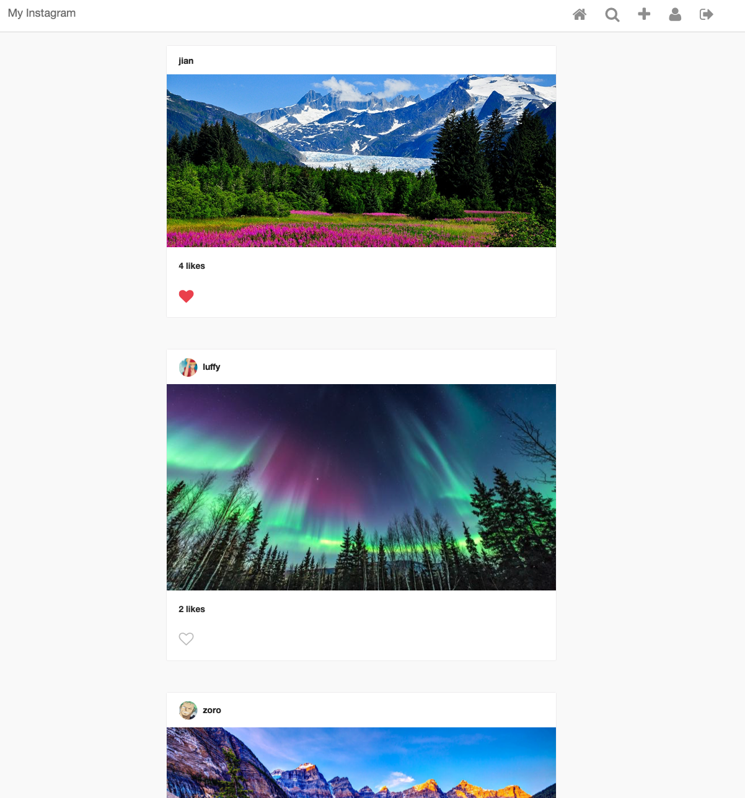

# My_Instagram

## Introduction
In this project, I built my own Instagram using Django as back-end framework. My Intagram hsa several important features
including Create, Read, Update, Delete (CRUD). Moreover, My Instagram also possesses Friend/Connection function, in which you
are able to make connections with others. Making connections can allow you to see the pictures posted by your friends. Additionally,
My Instagran also features Like function where you can like the posts of your connections.

## Required Skills :octocat:
* Django
* HTML/CSS
* JavaScript, AJAX
* Bootstrap, Font Awesome
* Deployment (Heroku)

## Demo


## Test :octocat:
My Instagram demo has been employed on Heroku. If you would like to explore on My Instagram,
I have created a account for you. Please visit ```https://afternoon-spire-29192.herokuapp.com/auth/login/```<br>
Your account would be:<br>
* User: shanks <br>
* Password: strawhat<br>


Cheers:+1:
